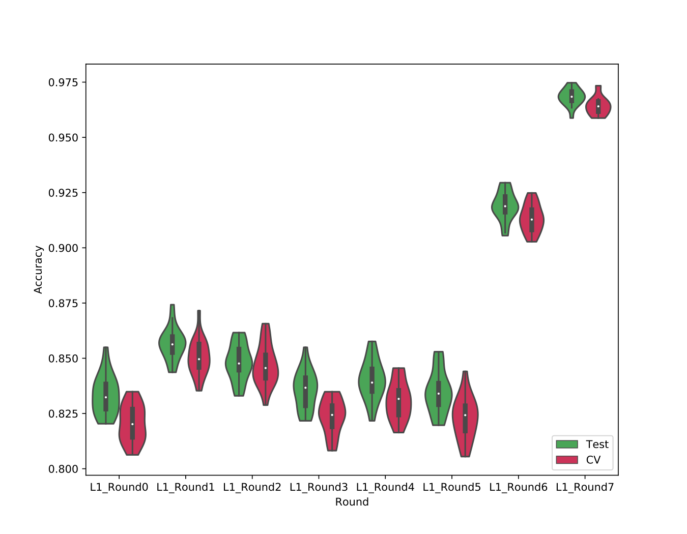

[](http://bioconda.github.io/recipes/sccaf/README.html)


# SCCAF: Single Cell Clustering Assessment Framework

Single Cell Clustering Assessment Framework (SCCAF) is a novel method for automated identification of putative cell types from single cell RNA-seq (scRNA-seq) data. By iteratively applying clustering and a machine learning approach to gene expression profiles of a given set of cells, SCCAF simultaneously identifies distinct cell groups and a weighted list of feature genes for each group. The feature genes, which are overexpressed in the particular cell group, jointly discriminate the given cell group from other cells. Each such group of cells corresponds to a putative cell type or state, characterised by the feature genes as markers.

# Requirements

This package requirements vary depending on the way that you want to install it (all three are independent, you don't need all these requirements):

- pip: if installation goes through pip, you will require Python3 and pip3 installed.
- Bioconda: if installation goes through Bioconda, you will require that [conda is installed and configured to use bioconda channels](https://bioconda.github.io/user/index.html).
- Docker container: to use SCCAF from its docker container you will need [Docker](https://docs.docker.com/install/) installed.
- Source code: to use and install from the source code directly, you will need to have git, Python3 and pip. 

# Installation

## pip

You can install SCCAF with pip:

```
pip install sccaf
```

## Bioconda

You can install SCCAF with bioconda (please setup conda and the bioconda channel if you haven't first, as explained [here](https://bioconda.github.io/user/index.html)):

```
conda install sccaf
```

## Available as a container

You can use the SCCAF tool already setup on a Docker container. You need to choose from the available tags [here](https://quay.io/repository/biocontainers/sccaf?tab=tags) and replace it in the call below where it says `<tag>`.

```
docker pull quay.io/biocontainers/sccaf:<tag>
```

Please not that Biocontainers containers do not have a latest tag, as such a docker pull/run without defining the tag will fail. For instance, a valid call would be (for version 0.0.3):

```
docker run -it quay.io/biocontainers/sccaf:0.0.3--py_0
```

Inside the container, you can either use the Python interactive shell or the command line version (see below).


## Use latest source code

Alternatively, for the latest version, clone this repo and go into its directory, then execute `pip3 install .`:

```
git clone https://github.com/SCCAF/sccaf
cd sccaf
# you might want to create a virtualenv for SCCAF before installing
pip3 install .
```

if your python environment is configured for python 3, then you should be able to replace python3 for just python (although pip3 needs to be kept). In time this will be simplified by a simple pip call.

# Usage within Python environment

## Use with pre-clustered `anndata` object in the [SCANPY](https://scanpy.readthedocs.io/en/stable/) package

The main method of SCCAF can be applied directly to an [anndata](https://anndata.readthedocs.io/en/stable/) (AnnData is the main data format used by [Scanpy](https://scanpy.readthedocs.io/en/stable/)) object in Python. 

**Before applying SCCAF, please make sure the doublets have been excluded and the batch effect has been effectively regressed.**

## Assessment of the quality of a clustering

Given a clustering stored in an anndata object `adata` under the key `louvain`, we would like to understand the quality (discrimination between clusters) with SCCAF:

```python
from SCCAF import SCCAF_assessment, plot_roc
import scanpy as sc

adata = sc.read("path-to-clusterised-and-umapped-anndata-file")
y_prob, y_pred, y_test, clf, cvsm, acc = SCCAF_assessment(adata.X, adata.obs['louvain'], n=100)
```

returned accuracy is in the `acc` variable.

The ROC curve can be plotted:

```python
import matplotlib.pyplot as plt

plot_roc(y_prob, y_test, clf, cvsm=cvsm, acc=acc)
plt.show()
```

Higher accuracy indicate better discrimination. And the ROC curve shows the problematic clusters. 

## Optimize an over-clustering

Given an over-clustered result, SCCAF optimize the clustering by merging the cell clusters that cannot be discriminated by machine learning:

```python

# The batch effect MUST be regressed before applying SCCAF
adata = sc.read("path-to-clusterised-and-umapped-anndata-file")

# An initial over-clustering needs to be assigned in consistent with the prefix for the optimization.
# i.e., the optimization prefix is `L2`, the starting point of the optimization of `%s_Round0`%prefix, which is `L2_Round0`.

sc.tl.louvain(adata, resolution=1.5, key_added='L2_Round0')
# i.e., we aim to achieve an accuracy >90% for the whole dataset, optimize based on the PCA space:
SCCAF_optimize_all(ad=adata, plot=False, min_acc=0.9, prefix = 'L2', use='pca')
```

in the above run, all changes will be left on the `adata` anndata object and no plots
will be generated. If you want to see the plots (blocking the progress until you close them)
then remove the `plots=False`.


Within the anndata object, assignments of cells to clusters will be left in `adata.obs['<prefix>_Round<roundNumber>']`.

# Usage from the command line

We have added convenience methods to use from the command line argument in the shell.
This facilitate as well the inclusion in workflow systems.

## Optimisation and general purpose usage

Given an annData dataset with louvain clustering pre-calculated (and batch corrected if needed):

```bash
sccaf -i <ann-data-input-file> --optimise --skip-assessment -s louvain -a 0.89 -c 8 --produce-rounds-summary
```

this will leave the result in new file named `output.h5`, which could be set via `-o`. In the current setting this will
produce a file named `rounds.txt` with the name of all optimisation rounds left in the output. This file
is used for later parallelisation (among different machines) of an assessment process to determine the step to choose
as final clustering.

To understand all options, simply execute `sccaf --help`.

## Parallel run of assessments

Once the optimisation has taken place, an strategy to choose the round to be used as final result is to observe the
distribution of accuracies for each on multiple iterations of the assessment process. How the process is distributed is
a matter of implementation of the local HPC or cloud system. Essentially, the process that can be repeated, per each round,
is:

```
round=<name-of-the-round-in-the-output>
sccaf-asses -i output.h5 -o results/sccaf_assess_$round.txt --slot-for-existing-clustering $round --iterations 20 --cores 8
```

running the above for a number of different rounds will leave files in the `results` folder.

### Merging parallel runs to produce plot

Once all assessment runs are done, the merging and plotting step can be run:

```
sccaf-assess-merger -i results -r rounds.txt -o rounds-acc-comparison-plot.png
```

This will produce a result like this:

